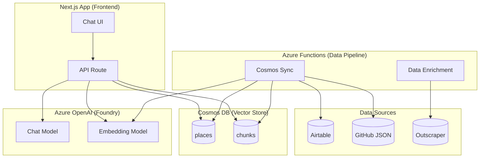

# AI Chat System Documentation

Technical specification for the AI-powered chat feature in Charlotte Third Places.

## Architecture Overview



## Data Pipeline (Azure Functions)

Located in `third-places-data/azure-function/`.

### Data Sources

1. **Airtable** - Primary data source for place metadata (name, type, neighborhood, tags, curator comments)
2. **GitHub JSON** - Enriched data files containing Google Maps details and reviews per place
3. **Outscraper** - Third-party API for fetching Google Maps data (reviews, hours, ratings)

### Cosmos DB Setup

- **Database**: `third-places`
- **Containers**:
  - `places` - One document per place, partitioned by `id` (Google Maps Place ID)
  - `chunks` - One document per review, partitioned by `placeId`
- **Provisioned Throughput**: 500 RU/s per container (1000 RU/s total, free tier limit)
- **Vector Index**: `quantizedFlat` on `embedding` field (1536 dimensions, cosine similarity)
- **Infrastructure Script**: `third-places-data/scripts/Initialize-CosmosDB.ps1`

#### Vector Index Choice: quantizedFlat vs diskANN

We use `quantizedFlat` instead of `diskANN`. This was a deliberate decision based on our data scale and query patterns.

**Microsoft's Guidance** ([Vector Search Documentation](https://learn.microsoft.com/en-us/azure/cosmos-db/nosql/vector-search)):

> "quantizedFlat is recommended when the number of vectors to be indexed is somewhere around 50,000 or fewer per physical partition. This is a good option for smaller scenarios, or scenarios where you're using query filters to narrow down the vector search to a relatively small set of vectors."

**Our Data Scale (as of December 2025)**:

| Container | Current / Max Vectors | Vectors Searched Per Query | Filter Used? |
|-----------|----------------------|---------------------------|--------------|
| `places` | ~380 / 500 projected | 380-500 (no filter) | No |
| `chunks` | ~95k / 125k max (500 × 250) | ~250 (filtered by placeId) | Yes |

**Why quantizedFlat Wins**:

1. **places container**: ~380 vectors (500 max projected) is 100× below the 50k/partition threshold. Brute-force over 500 vectors is trivially fast.

2. **chunks container**: We NEVER do unfiltered cross-partition vector search on chunks:
   - General queries (`/chat` page) skip chunk retrieval entirely (performance optimization)
   - Place-specific queries always filter by `placeId`, limiting search to ~250 vectors

3. **Accuracy**: quantizedFlat is still brute-force search with ~99% accuracy. diskANN is approximate nearest neighbors with ~95% accuracy. For an AI chatbot where quality matters, the extra accuracy is valuable.

4. **Simplicity**: No tuning parameters needed (diskANN has `indexingSearchListSize`, `quantizationByteSize`).

5. **Storage**: No separate graph index overhead.

**When to Reconsider diskANN**:

- If we add cross-partition chunk search for general queries (currently skipped)
- If we exceed 50,000+ places (currently ~380, projected max ~500)
- If P99 vector search latency becomes problematic (not observed)

**Vector Index Types Reference**:

| Type | Search Method | Accuracy | Best For |
|------|--------------|----------|----------|
| `flat` | Exact brute-force | 100% | ≤505 dimensions, tiny datasets |
| `quantizedFlat` | Compressed brute-force | ~99% | <50k vectors/partition, or filtered queries |
| `diskANN` | Graph-based ANN | ~95%+ | >50k vectors/partition, unfiltered queries |

### Sync Process

The `CosmosSync` endpoint (`/api/cosmos-sync`) orchestrates bulk sync using Azure Durable Functions:

1. Fetch all places from Airtable
2. For each place:
   - Fetch JSON data from GitHub (`data/places/{city}/{placeId}.json`)
   - Transform Airtable + JSON into Cosmos document format
   - Generate embedding for place using `compose_place_embedding_text()`
   - Upsert place document
   - Delete existing chunks for place (fresh sync)
   - For each review: transform, generate embedding, upsert chunk

**Key Files**:

- `blueprints/cosmos.py` - Durable Functions orchestrator and activities
- `services/cosmos_service.py` - Cosmos DB client operations
- `services/embedding_service.py` - Azure OpenAI embedding generation

### Embedding Text Composition

**Place Embedding** (`compose_place_embedding_text`):

```txt
{place_name} {place_type} {neighborhood}
{description}
Tags: {tags}
{curator_comments}
{reviews_tags}
```

**Chunk Embedding** (`compose_chunk_embedding_text`):

```txt
{place_name} {neighborhood} {place_type}
{review_text}
```

### Rate Limiting

- Batch size defaults to 1 (sequential) to avoid Cosmos 429 errors
- Embedding batches: 16 texts per API call (Azure OpenAI limit)
- Can be overridden with `batch_size` query parameter

**Reference**: [Azure Cosmos DB Request Units](https://learn.microsoft.com/en-us/azure/cosmos-db/request-units)

---

## Frontend Chat (Next.js)

Located in `charlotte-third-places/lib/ai/` and `charlotte-third-places/app/api/chat/`.

### Technology Stack

| Component | Package | Version | Purpose |
|-----------|---------|---------|---------|
| AI SDK Core | `ai` | 5.0.x | Streaming, message handling |
| React Hooks | `@ai-sdk/react` | 2.0.x | `useChat` hook |
| Azure Provider | `@ai-sdk/azure` | 2.0.x | Azure OpenAI integration |
| Cosmos Client | `@azure/cosmos` | - | Vector search queries |
| Markdown | `streamdown` | - | Streaming markdown render |

**Reference**: [Vercel AI SDK Documentation](https://sdk.vercel.ai/docs)

### Models (Azure OpenAI via Foundry)

Models are configured in `charlotte-third-places/lib/ai/config.ts`. See `AI_CONFIG` for current deployment names.

| Purpose | Config Key | Description |
|---------|------------|-------------|
| Chat completions | `chatModel` | Generates conversational responses |
| Query embeddings | `embeddingModel` | Converts text to vectors for similarity search |

**Endpoint**: `https://foundry-third-places.cognitiveservices.azure.com/`

### RAG Pipeline

```txt
lib/ai/rag.ts - performRAG()

1. Generate embedding for user query
2. If place-specific chat (placeId provided):
   - Direct lookup of place document
   - Vector search chunks for that place only (single partition)
   - Vector search related places
3. If general chat:
   - Vector search places only (skip chunks - see Performance section)
4. Format context with createContextMessage()
5. Return formatted context for system message injection
```

### RAG Configuration

```typescript
// lib/ai/config.ts

RAG_CONFIG = {
  generalPlaces: { topK: 25, minScore: 0.65 },    // More variety, catch hidden gems
  placeSpecificPlaces: { topK: 3, minScore: 0.7 },
  placeSpecificChunks: { topK: 15, minScore: 0.7 },
}

AI_CONFIG = {
  temperature: 1.0,       // High creativity for varied recommendations
  maxOutputTokens: 1536,  // Balance completeness vs speed
}
```

### Chat API Route

`app/api/chat/route.ts`:

```typescript
export async function POST(req: Request) {
  // 1. Parse messages and optional placeId from request
  // 2. Extract latest user query
  // 3. Perform RAG retrieval
  // 4. Build system messages (SYSTEM_PROMPT + RAG context)
  // 5. Stream response via Vercel AI SDK streamText()
}

export const maxDuration = 30; // Vercel limit
```

Uses `AbortSignal.timeout(25000)` to fail gracefully before Vercel's 30s limit.

### Vector Search Queries

**Places** (`vectorSearchPlaces`):

```sql
SELECT TOP @topK
  c.id, c.place, c.type, c.neighborhood, ...
  VectorDistance(c.embedding, @queryEmbedding) AS distance
FROM c
WHERE VectorDistance(c.embedding, @queryEmbedding) < @maxDistance
ORDER BY VectorDistance(c.embedding, @queryEmbedding)
```

**Chunks** (`vectorSearchChunks`):

```sql
-- With placeId (single partition, fast):
SELECT TOP @topK ... FROM c 
WHERE c.placeId = @placeId 
  AND VectorDistance(c.embedding, @queryEmbedding) < @maxDistance

-- Without placeId (cross-partition, slow - not used):
SELECT TOP @topK ... FROM c
WHERE VectorDistance(c.embedding, @queryEmbedding) < @maxDistance
```

**Reference**: [Cosmos DB Vector Search](https://learn.microsoft.com/en-us/azure/cosmos-db/nosql/vector-search)

---

## Performance Optimization

### The Cross-Partition Problem

**Issue**: General queries were timing out (30+ seconds).

**Root Cause**: The `chunks` container is partitioned by `placeId`. General queries require cross-partition fan-out across 300+ partitions. With 500 RU/s and `quantizedFlat` index, this took 5-10+ seconds just for chunk retrieval.

**Solution**: Skip chunk retrieval for general queries entirely.

```typescript
// lib/ai/rag.ts

if (placeId) {
  // Place-specific: fetch chunks (single partition, fast)
  chunks = await vectorSearchChunks(...);
} else {
  // General: skip chunks entirely
  // Place-level data (tags, curator notes, reviewsTags) is sufficient
  // for recommendations. Chunks add latency without proportional value.
}
```

**Result**: General queries now complete in 2-4 seconds instead of timing out.

### Why This Works

Place documents contain aggregated data sufficient for recommendations:

- `tags` - Curated feature labels (Fireplace, Quiet, Late Night, etc.)
- `comments` - Curator notes with insider knowledge
- `reviewsTags` - Aggregated keywords from Google reviews
- `description`, `neighborhood`, `type`, etc.

Individual review chunks are only needed when discussing a specific place in depth.

### Why This Enables quantizedFlat

This architectural decision is why we can use `quantizedFlat` instead of `diskANN`:

| Query Type | Container | Vectors Searched | Index Needed |
|------------|-----------|-----------------|--------------|
| General (`/chat`) | `places` only | ~380-500 | quantizedFlat ✓ |
| Place-specific | `chunks` with filter | ~250 | quantizedFlat ✓ |

If we ever re-enable cross-partition chunk search for general queries, we would need to reconsider diskANN for the chunks container. See [Vector Index Choice](#vector-index-choice-quantizedflat-vs-diskann) for full rationale.

---

## System Prompt

Located in `lib/ai/prompts.ts`.

### Persona

- Friendly, knowledgeable local guide for Charlotte third places
- Warm but efficient - helpful without being chatty
- Direct and specific in recommendations

### Key Guidelines

1. **Be Succinct**
   - No filler phrases ("Great question!", "Absolutely!")
   - Jump straight to answering
   - Short, focused responses

2. **Be Creative and Varied**
   - Access to 300+ places - use the full range
   - Never default to same 5-10 popular spots
   - Actively seek lesser-known gems
   - Cross-reference attributes creatively

3. **Stay On Topic**
   - When asked about a specific place, focus on that place only
   - Don't add unsolicited "You might also like..." suggestions
   - Only suggest alternatives when explicitly asked

4. **Use the Data**
   - **Tags**: Curated category labels for niche matching
   - **Comments**: Curator notes - highly authoritative first-hand accounts
   - **Reviews**: Real customer experiences from Google Maps
   - **Reviews Tags**: Aggregated themes (cozy atmosphere, good for work, etc.)

---

## UI Components

### Chat Pages

- `/chat` - General chat with starter prompts
- `/places/[slug]/chat` - Place-specific chat with pre-loaded context

### Components

| Component | Location | Purpose |
|-----------|----------|---------|
| `ChatContent` | `components/ChatContent.tsx` | Main chat UI with `useChat` hook |
| `Message` | `components/ai-elements/message.tsx` | Message bubbles with markdown |
| `PromptInput` | `components/ai-elements/prompt-input.tsx` | Input field with stop button |
| `Suggestions` | `components/ai-elements/suggestions.tsx` | Starter prompt chips |

### Styling

- User messages: Primary brand color background, white text, `font-semibold`
- AI messages: Subtle `bg-muted/50` background
- Submit button: `ArrowUpIcon` (ChatGPT-style)
- Mobile: Adjusted heights for bottom nav bar, reduced padding

### Markdown Rendering

Uses [Streamdown](https://github.com/vercel/streamdown) for streaming-compatible markdown.

Custom CSS fixes for list rendering:

```css
[&_ul>li>p]:mt-0
[&_ol>li>p]:mt-0
```

**Reference**: [AI Elements](https://github.com/vercel/ai-elements) - shadcn/ui compatible chat components

---

## Environment Variables

### Frontend (Next.js)

```bash
AZURE_OPENAI_API_KEY=         # Azure OpenAI API key
COSMOS_DB_CONNECTION_STRING=  # Cosmos DB connection string
```

### Backend (Azure Functions)

```bash
COSMOS_DB_CONNECTION_STRING=  # Cosmos DB connection string
FOUNDRY_API_KEY=              # Azure OpenAI/Foundry API key
AIRTABLE_PERSONAL_ACCESS_TOKEN=  # Airtable API token
```

---

## File Structure

```txt
charlotte-third-places/
├── app/
│   ├── api/chat/route.ts       # Chat API endpoint
│   ├── chat/page.tsx           # General chat page
│   └── places/[slug]/
│       └── chat/page.tsx       # Place-specific chat
├── components/
│   ├── ChatContent.tsx         # Main chat component
│   └── ai-elements/            # Chat UI components
│       ├── message.tsx
│       ├── prompt-input.tsx
│       └── suggestions.tsx
└── lib/ai/
    ├── config.ts               # AI/RAG configuration
    ├── cosmos.ts               # Cosmos DB vector search
    ├── embedding.ts            # Query embedding generation
    ├── prompts.ts              # System prompt + context formatting
    ├── rag.ts                  # RAG orchestration
    └── index.ts                # Exports

third-places-data/azure-function/
├── blueprints/
│   ├── cosmos.py               # Cosmos sync durable functions
│   └── places.py               # Place data refresh functions
└── services/
    ├── cosmos_service.py       # Cosmos DB operations
    └── embedding_service.py    # Embedding generation
```

---

## References

### Microsoft / Azure

- [Azure Cosmos DB Vector Search](https://learn.microsoft.com/en-us/azure/cosmos-db/nosql/vector-search)
- [Azure Cosmos DB Request Units](https://learn.microsoft.com/en-us/azure/cosmos-db/request-units)
- [Azure OpenAI REST API](https://learn.microsoft.com/en-us/azure/ai-foundry/openai/reference)
- [Azure Durable Functions](https://learn.microsoft.com/en-us/azure/azure-functions/durable/durable-functions-overview)
- [Microsoft Foundry SDK Overview](https://learn.microsoft.com/en-us/azure/ai-foundry/how-to/develop/sdk-overview)

### Vercel

- [Vercel AI SDK Documentation](https://sdk.vercel.ai/docs)
- [Vercel AI SDK - Azure OpenAI Provider](https://sdk.vercel.ai/providers/ai-sdk-providers/azure)
- [Vercel AI SDK - useChat Hook](https://sdk.vercel.ai/docs/reference/ai-sdk-ui/use-chat)
- [Vercel AI SDK - streamText](https://sdk.vercel.ai/docs/reference/ai-sdk-core/stream-text)

### UI

- [Vercel AI Elements](https://github.com/vercel/ai-elements/) - Chat components for shadcn/ui
- [Streamdown](https://github.com/vercel/streamdown) - Streaming markdown renderer
- [shadcn/ui](https://ui.shadcn.com/) - Component library

### Data

- [Airtable API](https://airtable.com/developers/web/api/introduction)
- [Outscraper Google Maps API](https://outscraper.com/)
