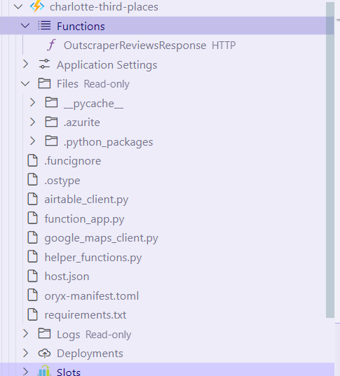

# Developer Notes

A scratch pad for various notes related to this project.

## Next.js

The front end us Next.js deployed to Vercel (Hobby Tier) with `shadcn/ui` for styling.

* To run locally `cd` into the `charlotte-third-places` directory and run `npm run dev`.

No website - Should remain empty.
WiredCoffeeExpress
MadoCafe

Manually removed website, shouild come back properly formatted
Wooden Robot

## Random Information

A PlaceCard component where you pass in the Airtable record Id, and with that, it returns the full formed card for that place. IT uses cached data to accomplish this, no need to call the Airtable API.

* To stop Azurite from writing its logs to undesirable locations I set the `Azurite: Location` in settings to the relative path (starting from the C:\ drive) `/GitHub/charlotte-third-places/azure-function/.azurite` The folder is ignored in the `.gitignore`.
* Testing locally, if you use `venv` you can get weird networking issues tunneling from the virtual environment to the public internet. If you're comfortable with your local environment move to it to overcome some of  that.
* You need to place any third-party Python libraries in `requirements.txt` so they're installed in the cloud for use during deployments and production execution.
* Remember to start and stop Azurite for local testing if you're using local storage.
* See [this page](https://outscraper.com/place-id-feature-id-cid/) for a `google_id` explainer. I have found no use for it but it's returned by the Outscraper API.
* When using Python's logging module pass `exc_info=True` to get the stack trace.
* Light color for personal website is #0092ca and the dark color is #f21368

## Azure Function

To debug the Azure Function locally, follow the guidance in the [quickstart](https://learn.microsoft.com/en-us/azure/azure-functions/create-first-function-vs-code-python). In summary, you'll need to do the following.

### Things to Know

* To make sure you get to logs read through [this page](https://learn.microsoft.com/en-us/azure/azure-functions/configure-monitoring) and configure your `host.json`
* To understand why `host.json` has an `excluded_types` section check out [this page](https://learn.microsoft.com/en-us/azure/azure-functions/configure-monitoring?tabs=v2#configure-sampling)
* Read through [this](https://learn.microsoft.com/en-us/azure/azure-functions/functions-bindings-http-webhook-trigger?tabs=python-v2%2Cisolated-process%2Cnodejs-v4%2Cfunctionsv2&pivots=programming-language-python#http-auth) page for more details on how HTTP Azure Functions work.
* Read through [this](https://learn.microsoft.com/en-us/azure/azure-functions/function-keys-how-to?tabs=azure-portal) page for details on how Azure Function keys work.
* Read through [this](https://learn.microsoft.com/en-us/azure/azure-functions/durable/durable-functions-types-features-overview) to understand how Durable functions work. For any long running task (more than 3 minutes or so), you need to use a Durable Function. Default Azure Functions will time out.
* To understand Task Hubs in Durable Functions <https://learn.microsoft.com/en-us/azure/azure-functions/durable/durable-functions-task-hubs?tabs=csharp>
* Azure Funtions timeout at 10 minutes, 30 minutes on the higher plans. <https://learn.microsoft.com/en-us/azure/azure-functions/functions-host-json#functiontimeout>. You can change this though, or you should be able to, by using a Durable Function and modifying settings in your `host.json`.

### Using Emulated Storage

1. Start the Azurite Blob Service. This can be done from the command panel `CTRL + Shift + P`.
2. Debug `function_app.py` with a `launch.json` file that looks like the [below JSON](#launch-file). Right now this configuration should be setup already in the `.vscode` folder.
3. Navigate to the Azure tab in the left bar and under Workspace expand Local Project. The function should be under there where you can right-click and execute it, providing your own body.

### Using Real Storage

1. Make sure in your `local.settings.json` file you have `AzureWebJobsStorage` set to the connection string of a storage account. The format is `DefaultEndpointsProtocol=https;AccountName=charlottethirdplaces;AccountKey=[AccountKeyHere];EndpointSuffix=core.windows.net`
2. Debug `function_app.py` with a `launch.json` file that looks like the [below JSON](#launch-file). Right now this configuration should be setup already in the `.vscode` folder.
3. Navigate to the Azure tab in the left bar and under Workspace expand Local Project. The function should be under there where you can right-click and execute it, providing your own body.

### Durable Functions

To test a durable function locally, you need to hit the endpoint of the HTTP trigger function with the name of the orchestrator you're targeting. After that, you get back a bunch of URLs you can poll to check the status.

The response from calling `create_check_status_response` in the HTTP trigger of a Durable Function. Returns endpoints needed to monitor or stop the orchestration.

```json
{
  "id": "118ea5b7831f45c5bd5d6bf5fa4f2ab4",
  "statusQueryGetUri": "http://localhost:7071/runtime/webhooks/durabletask/instances/118ea5b7831f45c5bd5d6bf5fa4f2ab4?taskHub=TestHubName&connection=Storage&code=Redacted",
  "sendEventPostUri": "http://localhost:7071/runtime/webhooks/durabletask/instances/118ea5b7831f45c5bd5d6bf5fa4f2ab4/raiseEvent/{eventName}?taskHub=TestHubName&connection=Storage&code=Redacted",
  "terminatePostUri": "http://localhost:7071/runtime/webhooks/durabletask/instances/118ea5b7831f45c5bd5d6bf5fa4f2ab4/terminate?reason={text}&taskHub=TestHubName&connection=Storage&code=Redacted",
  "rewindPostUri": "http://localhost:7071/runtime/webhooks/durabletask/instances/118ea5b7831f45c5bd5d6bf5fa4f2ab4/rewind?reason={text}&taskHub=TestHubName&connection=Storage&code=Redacted",
  "purgeHistoryDeleteUri": "http://localhost:7071/runtime/webhooks/durabletask/instances/118ea5b7831f45c5bd5d6bf5fa4f2ab4?taskHub=TestHubName&connection=Storage&code=Redacted",
  "restartPostUri": "http://localhost:7071/runtime/webhooks/durabletask/instances/118ea5b7831f45c5bd5d6bf5fa4f2ab4/restart?taskHub=TestHubName&connection=Storage&code=Redacted",
  "suspendPostUri": "http://localhost:7071/runtime/webhooks/durabletask/instances/118ea5b7831f45c5bd5d6bf5fa4f2ab4/suspend?reason={text}&taskHub=TestHubName&connection=Storage&code=Redacted",
  "resumePostUri": "http://localhost:7071/runtime/webhooks/durabletask/instances/118ea5b7831f45c5bd5d6bf5fa4f2ab4/resume?reason={text}&taskHub=TestHubName&connection=Storage&code=Redacted"
}
```

When the Durable Function call is fully complete the final response looks similar to the below. You get this structure from calling the `statusQueryGetUri` returned by the initial call.

```json
{
  "name": "get_outscraper_reviews_orchestrator",
  "instanceId": "fd1575779e994ba8a9110153f4173a3e",
  "runtimeStatus": "Completed",
  "input": null,
  "customStatus": null,
  "output": "Hello mate. Just verifying things work for now",
  "createdTime": "2024-08-25T22:19:40Z",
  "lastUpdatedTime": "2024-08-25T22:19:42Z"
}
```

For your `local.settings.json` this is the setup I had for valuable logging locally but not too much. Reference <https://learn.microsoft.com/en-us/azure/azure-functions/configure-monitoring?tabs=v2> and <https://github.com/anthonychu/functions-log-suppression>.

```json
{
  "IsEncrypted": false,
  "Values": {
    "AzureWebJobsStorage": "Connection string goes here. Can find this in Azure on the Environment variables tab",
    "FUNCTIONS_WORKER_RUNTIME": "python",
    "AzureWebJobsFeatureFlags": "EnableWorkerIndexing",
    "AZURE_FUNCTION_KEY": "Get this from Azure",
    "WEBSITE_RUN_FROM_PACKAGE": 1,
    "PYTHON_ENABLE_WORKER_EXTENSIONS": "1",
    "AIRTABLE_BASE_ID": "Get from Airtable",
    "AIRTABLE_PERSONAL_ACCESS_TOKEN": "Get from Airtable",
    "GOOGLE_MAPS_API_KEY": "Get from Google",
    "GITHUB_PERSONAL_ACCESS_TOKEN": "Get from GitHub",
    "OUTSCRAPER_API_KEY": "Get from Outscraper",
    "logging:logLevel:Microsoft": "None",
    "logging:logLevel:Worker": "None",
    "AzureFunctionsJobHost:logging:logLevel:default": "Warning",
    "AzureFunctionsJobHost:logging:logLevel:Host.Function.Console": "None"
  }
}
```

For testing the durable function using the script in the `data` folder.

```PowerShell
.\Invoke-DurableFunction.ps1 -OrchestratorUrl "http://localhost:7071/api/orchestrators/get_outscraper_reviews_orchestrator" -TimeoutSeconds 300
```

### Troubleshooting

Tips on troubleshooting weird stuff with the Azure Function.

If the local deploy from VSCode is showing `getaddrinfo enotfound` as an error messsage, flush your DNS using `ipconfig /flushdns` and wait a minute or two before trying again.

I ran into the issue where you deploy the Azure Function, either from VSCode locally or from a GitHub action, and the deployment goes green, but the Azure Function disappears from the portal. What an annoying issue that is. The reasons for this can be numerous, read through [this thread](https://github.com/Azure/azure-functions-python-worker/issues/1338) and [this thread](https://github.com/Azure/azure-functions-python-worker/issues/1262) and [this thread](https://www.reddit.com/r/AZURE/comments/1cuz049/azure_function_swallows_a_build_error_no_way_to/) for things people have done to fix this issue. The answer is, you could be doing many things wrong, you need to dig deep to figure out which is your issue. In my case, the structure of the directory being uploaded when I started using a GitHub action was wrong. The GitHub action I had initially was generated by Azure using their GitHub integration feature, and it was wrong. Deploying locally from VSCode though I had things working, and so using the "Azure" tab in VSCode (no idea how to do this in the portal) I browsed the function app after a successful local deploy to peep the structure of the folder. Screenshot below. Your end state must be Python packages from your requirements file installed to a `.python_packages` folder in the root, and all other files in the root. I think you could get away with a folder such as `shared_code` to reference modules, but I was having issues with that. This was all with V2 of Python Azure Functions.



### Launch File

```json
{
    "version": "0.2.0",
    "configurations": [
        {
            "name": "Attach to Python Functions",
            "type": "debugpy",
            "request": "attach",
            "connect": {
                "host": "localhost",
                "port": 9091
            },
            "preLaunchTask": "func: host start"
        }
    ]
}
```

### Test Code

All of these endpoints are secured with key authentication. This is assuming you're debugging locally, in which case keys aren't needed.

For posting to `SmokeTest`.

```json
{"House": "Martell"}
```

For posting to `EnrichAirtableBase`.

```json
{"TheMotto": "What is dead may never die, but rises again harder and stronger"}
```

For posting to `OutscraperReviewsResponse`.

```json
{
    "id": "your-request-id",
    "user_id": "your-user-id",
    "status": "SUCCESS",
    "api_task": true,
    "results_location": "https://api.app.outscraper.com/requests/YXV0aDB8NjNhMzRkZGRjNmRmNDM5MGJmM2ZkMzZjLDIwMjQwODE3MjA1OTM1eHM0YQ",
    "quota_usage": [
        {
            "product_name": "Google Maps Data",
            "quantity": 1
        }
    ]
}
```

### Outscraper

Details about [Outscraper](https://outscraper.com/) and it's role in helping to process reviews.

### Webhooks

Outscraper allows users to write a custom webhook and have them hit that endpoint with the response of requesting reviews. You can view the result of webhook calls [here](https://app.outscraper.com/webhook-calls).

Visit the [Integrations](https://app.outscraper.com/integrations) page to set the webhook URL. Read through the [Access Keys](https://learn.microsoft.com/en-us/azure/azure-functions/function-keys-how-to?tabs=azure-portal) page for Azure Functions to understand how authentication works. In summary, provide an endpoint that grants access to 1 function (use a Function Key), rather than all of them.

### Response Format

For testing Outscraper webhooks locally. The `results_location` expires after 24 hours or so. To get a new one, go to the Outscraper portal, make a Google Maps API reviews request, and then go to <https://app.outscraper.com/api-usage> to get the `results_location`.

```json
{
    "id": "your-request-id",
    "user_id": "your-user-id",
    "status": "SUCCESS",
    "api_task": true,
    "results_location": "https://api.app.outscraper.com/requests/YXV0aDB8NjNhMzRkZGRjNmRmNDM5MGJmM2ZkMzZjLDIwMjQwODE3MjA1OTM1eHM0YQ",
    "quota_usage": [
        {
            "product_name": "Google Maps Data",
            "quantity": 1
        }
    ]
}
```

When you're using Outscraper's Python API this is what the result of calling their `google_maps_reviews` returns. It's a list of dictionaries.

```python
{'query': 'ChIJJ1k-2i6gVogRYNxihxv5ONI', 'name': 'Amélie’s French Bakery & Café | Carmel Commons', 'name_for_emails': 'Amélie’S French Bakery And Café | Carmel Commons', 'place_id': 'ChIJJ1k-2i6gVogRYNxihxv5ONI', 'google_id': '0x8856a02eda3e5927:0xd238f91b8762dc60', 'full_address': '7715 Pineville-Matthews Rd Unit 34B, Charlotte, NC 28226', 'borough': 'McAlpine', 'street': '7715 Pineville-Matthews Rd Unit 34B', 'postal_code': '28226', 'area_service': False, 'country_code': 'US', 'country': 'United States of America', 'city': 'Charlotte', 'us_state': 'North Carolina', 'state': 'North Carolina', 'plus_code': '867X34PX+FP', 'latitude': 35.0861975, 'longitude': -80.85066499999999, 'h3': '8944d84ae27ffff', 'time_zone': 'America/New_York', 'popular_times': [{...}, {...}, {...}, {...}, {...}, {...}, {...}, {...}], 'site': 'http://www.ameliesfrenchbakery.com/?utm_source=local', 'phone': '+1 704-376-1782', 'type': 'Bakery', 'logo': 'https://lh3.googleusercontent.com/-QD2bj7tNKB8/AAAAAAAAAAI/AAAAAAAAAAA/AQi-ylqiyPo/s44-p-k-no-ns-nd/photo.jpg', 'description': 'This charming gathering place draws a crowd for its pastries, light fare & coffee drinks.', 'typical_time_spent': 'People typically spend 15 min to 1 hr here', 'located_in': 'Carmel Commons', 'located_google_id': '0x88569d073037a283:0x407bb9a1c726e55e', 'category': 'Bakery', 'subtypes': 'Bakery, Coffee shop, French restaurant, Wedding bakery, Wholesale bakery, Wi-Fi spot', 'posts': None, 'reviews_tags': ['macaroons', 'soup', 'breakfast sandwich', 'espresso', 'patio', 'fruit tart', 'caramel brownie', 'chai latte', 'french press', 'chocolate mousse'], 'rating': 4.5, 'reviews': 1742, 'reviews_data': [{...}, {...}, {...}, {...}, {...}, {...}, {...}, {...}, {...}, {...}, {...}, {...}, {...}, {...}, {...}, {...}, {...}, {...}, {...}, ...], 'photos_count': 1152, 'cid': '15148131243291499616', 'reviews_link': 'https://search.google.com/local/reviews?placeid=ChIJJ1k-2i6gVogRYNxihxv5ONI&authuser=0&hl=en&gl=US', 'reviews_id': '-3298612830418052000', 'photo': 'https://lh5.googleusercontent.com/p/AF1QipP44c8672a5AUgingSIuB6JqYmxjWTLKFlSINAU=w800-h500-k-no', 'street_view': 'https://lh5.googleusercontent.com/p/AF1QipMUx6LEfIAyKTkgnusVXi4ZuxVfnybbDWx3vdFq=w1600-h1000-k-no', 'working_hours_old_format': 'Monday:7AM-7PM|Tuesday:7AM-7PM|Wednesday:7AM-7PM|Thursday:7AM-7PM|Friday:7AM-9PM|Saturday:7AM-9PM|Sunday:7AM-7PM', 'working_hours': {'Monday': '7AM-7PM', 'Tuesday': '7AM-7PM', 'Wednesday': '7AM-7PM', 'Thursday': '7AM-7PM', 'Friday': '7AM-9PM', 'Saturday': '7AM-9PM', 'Sunday': '7AM-7PM'}, 'other_hours': None, 'business_status': 'OPERATIONAL', 'about': {'From the business': {...}, 'Service options': {...}, 'Accessibility': {...}, 'Dining options': {...}, 'Amenities': {...}, 'Crowd': {...}, 'Planning': {...}, 'Payments': {...}, 'Parking': {...}, 'Other': {...}}, 'range': '$$', 'reviews_per_score': None, 'reviews_per_score_1': None, 'reviews_per_score_2': None, 'reviews_per_score_3': None, 'reviews_per_score_4': None, 'reviews_per_score_5': None, 'reservation_links': None, 'booking_appointment_link': 'https://food.google.com/chooseprovider?restaurantId=/g/1tfv1816&g2lbs=AOHF13k0cN3OzkD_Wp9mxwHsk-4uEIjeX69ELpcDlbV6msv7CglZV45DtxbrWTpuht05RGcAv_rIlrt6MVlyP6xzcSno5Zk-_7p72LRoqGhSh9-YGLBVyO4%3D&hl=en-US&gl=us&fo_m=MfohQo559jFvMUOzJVpjPL1YMfZ3bInYwBDuMfaXTPp5KXh-&utm_source=tactile&gei=VFjKZqTVCrKF0PEP3OngqQk&ei=VFjKZqTVCrKF0PEP3OngqQk&fo_s=OA,SOE&opi=79508299&orderType=2&foub=mcpp', 'menu_link': 'https://www.toasttab.com/amelies-french-bakery-carmel-commons-7715-pineville-matthews-road-space-34b/v3#!/', 'order_links': None, 'owner_id': '103411538791022838693', ...}
```
